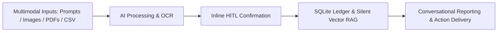

# 📄 Product Requirement Document (PRD): MoneyChingu AI

## 1. Executive Summary
**MoneyChingu AI** is an intelligent, multimodal personal finance and money tracking application powered by **Google Gemini AI**, **Streamlit**, and **SQLite**. It replaces tedious manual spreadsheet logging with a natural language conversational agent that can parse receipts via Vision AI, extract transactions from bank statements (PDF/CSV), enforce budgets, perform semantic memory search (RAG), and provide Human-in-the-Loop (HITL) review.

---

## 2. Target Users & Problem Statement

### 2.1 Target Persona
- **Single User / Power User**: Individuals, freelancers, and professionals looking for a frictionless, private, and automated financial tracking system with dual currency support (**USD \$** and **IDR Rp**).

### 2.2 Core Problems Solved
1. **Manual Entry Fatigue**: Logging transactions into spreadsheets daily is tedious and prone to abandonment.
2. **Data Inaccuracies**: Mistyped numbers, missed paper receipts, or lost bank records.
3. **No Proactive Advice**: Static spreadsheets don't warn about overspending or answer conversational questions about historical spending habits.
4. **Data Privacy**: Users want their financial ledger stored locally rather than exposed to third-party cloud servers.

---

## 3. Product Features & Functional Requirements

### 3.1 Feature Matrix

| Feature | Description | Priority |
| :--- | :--- | :--- |
| **Single-Pane Chat Interface** | Conversational chat stream positioned right above the text input with zero sidebar distraction. | **P0 (Critical)** |
| **Inline Chat Toolbar (Tools & Attach)** | Sleek popovers directly above chat input: `🛠️ Tools` (Recent Transactions, Check Balances) and `➕ Attach` (receipts, statements) with live preview. | **P0 (Critical)** |
| **All-in-One Conversational CRUD** | Agent creates, reads, updates, and deletes transactions, accounts, budgets, and produces instant reports directly in chat. | **P0 (Critical)** |
| **Multimodal Vision OCR & Summary** | Gemini Vision extracts merchant, date, amount, currency, and items, presenting a visual analysis summary banner with editable notes. | **P0 (Critical)** |
| **Inline Human-in-the-Loop (HITL)** | Editable confirmation card displayed directly within the chat message stream before saving records to SQLite. | **P0 (Critical)** |
| **Action Permission Gate** | Destructive / irreversible actions (`clear_database`, `delete_transaction`, `delete_account`, `transfer_funds`) are intercepted and require explicit confirmation (`✅ Yes, Proceed` / `❌ Cancel`). | **P0 (Critical)** |
| **4-Pillar Context Engineering** | Google-standard architecture: external memory persistence (WRITE), JIT tool/intent assembly (SELECT), hybrid token compression (COMPRESS), and authority hierarchy (ISOLATE). | **P0 (Critical)** |
| **Dual Currency Engine** | Full support for **USD (\$ )** and **IDR (Rp)** with live conversion rate calculations and multi-currency accounts. | **P0 (Critical)** |
| **Silent RAG Pipeline** | Background vector retrieval automatically enriches prompt context with relevant memories on every user query. | **P0 (Critical)** |
| **Local SQLite Persistence** | Zero-latency, privacy-first local database storing accounts, transactions, budgets, agent memory, and audit logs. | **P0 (Critical)** |

---

## 4. System Architecture & Tech Stack

- **Frontend**: Streamlit 1.35+ with responsive custom CSS, popover toolbars, and inline chat confirmation cards.
- **AI Core**: Google Gemini Free Tier (`gemini-3.6-flash`, `gemini-2.0-flash`) + Google `text-embedding-004`.
- **Engineering Standards**:
  - **Anthropic Prompt Engineering**: Layered XML-based prompts (`<role>`, `<authority>`, `<rules>`, `<categories>`, `<format>`, `<scratchpad>`) with strict priority hierarchy.
  - **Google Context Engineering**:
    1. **WRITE (External State Persistence)**: Typed memory storage in `agent_memory` SQLite table (`episodic`, `semantic`, `procedural`).
    2. **SELECT (Just-in-Time Assembly)**: Bilingual Intent Router dynamically injects 3–5 relevant tools per turn.
    3. **COMPRESS (Token Pruning & Compaction)**: Strips scratchpads, produces rolling conversation summaries, and condenses large tables to 1-line badges.
    4. **ISOLATE (Boundary Decoupling)**: Strict authority hierarchy (`<rules>` > `<context>` > `<user_profile>` > `<memories>` > `<conversation_summary>`) and pre-execution schema sanitization.
- **Database**: SQLite3 (Local ledger with relational constraints) + Vector Store (JSON/SQLite cosine similarity).
- **Languages & Frameworks**: Python 3.10+, Pandas, Pillow, PyPDF2, Plotly, NumPy, Scikit-learn.

---

## 5. Security & Privacy
- **Local-First Storage**: All transaction data, accounts, and budgets reside exclusively on the user's local machine in `data/money_tracker.db`.
- **API Key Safety**: API keys are loaded via `.env` or input via secure password fields and never committed to version control.
- **Audit Logs & Permission Gates**: Every mutation is logged in `audit_logs`, and destructive operations require explicit user approval.

---

## 6. Progress Log & Release History

### v1.2.0 (Current Release)
- **UI Toolbar Redesign**: Replaced 4 bulky buttons with compact inline `🛠️ Tools` (Recent Transactions, Check Balances) and `➕ Attach` popover directly above chat input.
- **In-Chat Document Preview & Editable Notes**: In-chat document preview with AI analysis summary banner and editable multi-line notes in the confirmation card.
- **Destructive Action Routing & Action Permission Gate**: Built-in protection for data wipe/delete prompts, requiring explicit user confirmation before execution.
- **4-Pillar Context Engineering**: Full architecture implementing WRITE, SELECT, COMPRESS, and ISOLATE pillars to defeat Context Poisoning, Distraction, Confusion, and Clash.
- **Persistent Memory & Preferences**: SQLite-backed `agent_memory` and `user_preferences` for cross-session continuity.
- **FIFO Prompt Queue**: Sequential handling for consecutive user messages.
