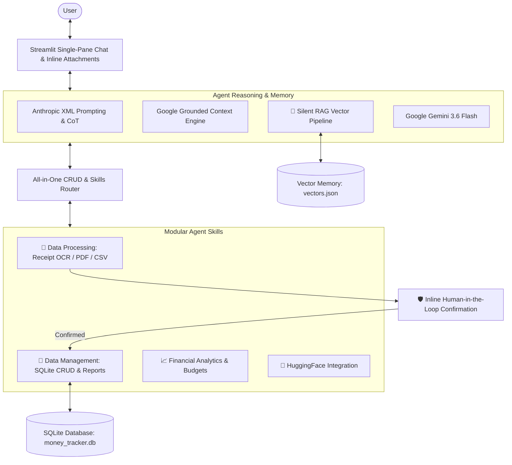

# 💰 MoneyChingu AI: Multimodal Financial Tracking Agent

[](https://www.python.org/)
[](https://streamlit.io/)
[](https://aistudio.google.com/)
[](https://www.sqlite.org/)
[](https://opensource.org/licenses/MIT)

> An intelligent, conversational AI Financial Tracking Assistant that turns messy receipts, bank statements (PDF/CSV), and casual text prompts into clean, categorized, audited financial records. Features dual-currency support (**USD \$** & **IDR Rp**), **Human-in-the-Loop (HITL)** confirmation, and **RAG Semantic Memory**.

---

## 🌟 Key Highlights & Features

- 💬 **Single-Pane Conversational UI**: Focused, distraction-free chat interface with chat session displayed cleanly above the input box (no complex sidebars).
- 🛠️ **All-in-One Conversational CRUD**: The agent creates/reads/updates/deletes transactions, accounts, budgets, and produces instant reports (tables, cash flow, net worth) directly in the chat stream.
- 📸 **Inline Multimodal Ingestion**: Upload receipt images, bank PDFs, or CSV exports directly into chat for instant AI parsing.
- 🛡️ **Human-in-the-Loop (HITL) Verification**: Preview extracted records in an editable confirmation card inline before saving to SQLite.
- 🧠 **Silent RAG Pipeline**: Background vector retrieval with Google `text-embedding-004` automatically enriches prompt context with relevant memories on every user query.
- 🌐 **Dual International Currency**: Native support for **USD (\$ )** and **IDR (Rp)** with automated conversion.
- 🔒 **Privacy-First & Local Storage**: 100% local SQLite database.

---

## 🏗️ System Architecture



---

## 📁 Project Structure

```
Tracking_Money/
├── app.py                      # Streamlit Main Dashboard & Chat Controller
├── config.py                   # App Configuration, Model Settings, & Currency Rates
├── requirements.txt            # Python Dependencies
├── PRD.md                      # Product Requirement Document
├── README.md                   # Repository Documentation
├── .env.example                # Environment Variable Template
├── core/
│   ├── agent.py                # Central AI ReAct Agent with Tool Routing & HITL
│   ├── gemini_client.py        # Gemini API Client (Multimodal & Free Tier)
│   ├── prompts.py              # Anthropic XML Prompt Templates & Context Grounding
│   └── context_manager.py      # Google Context Engineering & Token Management
├── database/
│   ├── db.py                   # SQLite Database Manager (Accounts, Transactions, Budgets)
│   ├── vector_store.py         # Vector Store with Google Embeddings for RAG
│   └── seed_data.py            # Initial Seed Data for Instant Setup
├── skills/
│   ├── base.py                 # Abstract Base Skill
│   ├── data_processing.py      # Multimodal OCR, PDF & CSV Parser
│   ├── data_management.py      # SQLite CRUD, Balance Reconciliation, CSV Export
│   ├── financial_analytics.py  # Budget Burn Rates, Cash Flows, Currency Math
│   ├── rag_context.py          # Semantic Retrieval over Financial Memory
│   └── hf_skills.py            # HuggingFace Zero-Shot Categorization & Sentiment
├── ui/
│   ├── components.py           # HITL Confirmation Cards, KPI Metric Widgets
│   ├── charts.py               # Plotly Interactive Visualizations
│   └── styles.py               # Sleek Modern Dark/Glassmorphic CSS Theme
└── tests/
    ├── test_money_tracker.py   # Unit Tests for Database, Skills, and Vector RAG
    └── test_agent.py           # Unit Tests for Agent Core & Prompt Grounding
```

---

## 🚀 Quick Start Guide

### 1. Clone the Repository
```bash
git clone https://github.com/PandhuPrayogo/MoneyChingu.git
cd MoneyChingu
```

### 2. Set Up Virtual Environment
```bash
# Windows
python -m venv venv
venv\Scripts\activate

# macOS / Linux
python3 -m venv venv
source venv/bin/activate
```

### 3. Install Dependencies
```bash
pip install -r requirements.txt
```

### 4. Configure Gemini API Key (Free Tier)
Create a `.env` file or copy from `.env.example`:
```bash
cp .env.example .env
```
Add your free Google Gemini API key (obtainable at [Google AI Studio](https://aistudio.google.com/)):
```env
GEMINI_API_KEY=AIzaSy...
GEMINI_MODEL=gemini-3.6-flash
USD_TO_IDR_RATE=16000.0
```
*(Note: You can also enter or switch your Gemini API key directly inside the Streamlit sidebar UI at runtime).*

### 5. Launch the Application
```bash
streamlit run app.py
```
The app will open automatically in your browser at `http://localhost:8501`.

---

## 🧪 Running Unit Tests

Run the complete test suite to verify database operations, skills, currency conversions, and agent reasoning:

```bash
python -m unittest discover -s tests -v
```

---

## 💡 Usage Examples

### 1. Conversational Logging
* *"Spent \$24 on sushi lunch at Tokyo Dine with credit card"*
* *"Beli kopi kenangan 45000 IDR pake GoPay"*
* *"Received \$2,500 salary from employer"*

### 2. Receipt Vision Scanning
1. Expand **"📸 Drop Receipt Image, PDF Statement, or CSV File"** in Tab 1.
2. Upload a receipt or invoice photo.
3. Click **"🔍 Analyze & Extract with AI"**.
4. Review the **Human-in-the-Loop (HITL)** editable confirmation card.
5. Click **"✅ Confirm & Save"** to update your ledger.

### 3. Financial Analytics & RAG
* *"How much did I spend on Food this month in USD?"*
* *"Show my current budget burn rate."*
* *"Where did I buy that pasta dinner last week?"* (Searches semantic vector memory).

---

## 📜 License
Distributed under the MIT License. See `LICENSE` for more information.
